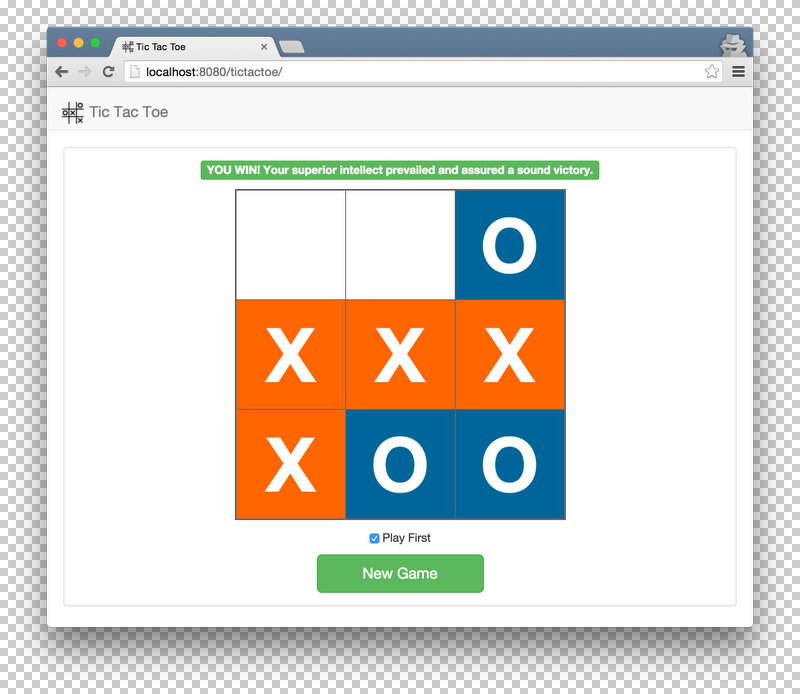

# Tic Tac Toe

A simple web app to play Tic Tac Toe against a dummy computer opponent.
 
## Features & Notes:
* Play a game of Tic Tac Toe on a 3x3 board.
* Start a new game at any time with an option to go first or after the computer opponent.
* Computer opponent's AI is simple and chooses squares at random (except when going first, then center tile is always picked).
* Game data persists to user's http session.
* For sake of simplicity web app does not come with a test suite or ability to persist data to a database.
* App has been designed to render each time through a full page refresh (also in the name of simplicity).
* Player can leave the game and come back later to finish it (as long as his session persists).

## Tech Stack:
* Language: Java 8
* Framework: Spring Boot
* UI Layer: HTML, CSS, Javascript, jQuery, Bootstrap, [Thymeleaf](http://www.thymeleaf.org/) (Java Template Engine)
* Build Tool: Gradle

## Install & Run:
* Install Java 8.
* Download and install gradle from [https://gradle.org/gradle-download/](https://gradle.org/gradle-download/).
* git clone https://github.com/randomvlad/TicTacToe.git
* Change directory to "TicTacToe" and run command "gradle bootRun".
* Make sure your host file is configured for localhost. Example: map IP 127.0.0.1 to localhost.
* Once gradle build has finished and is running, go to [http://localhost:8080/tictactoe/](http://localhost:8080/tictactoe/) and play a game.
* To terminate gradle bootRun, kill process with CTRL + C. 

## Game Screenshot

