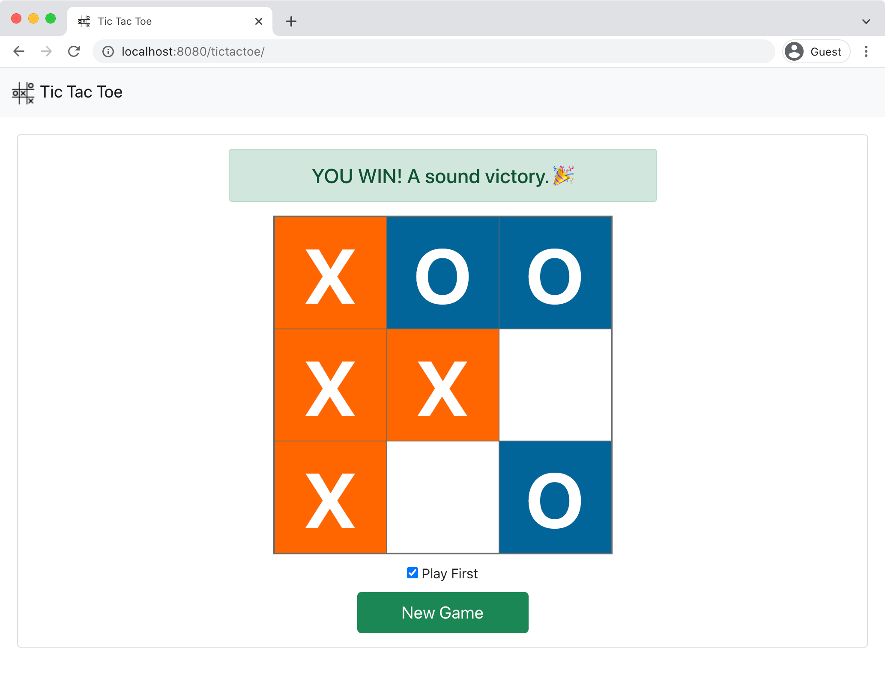
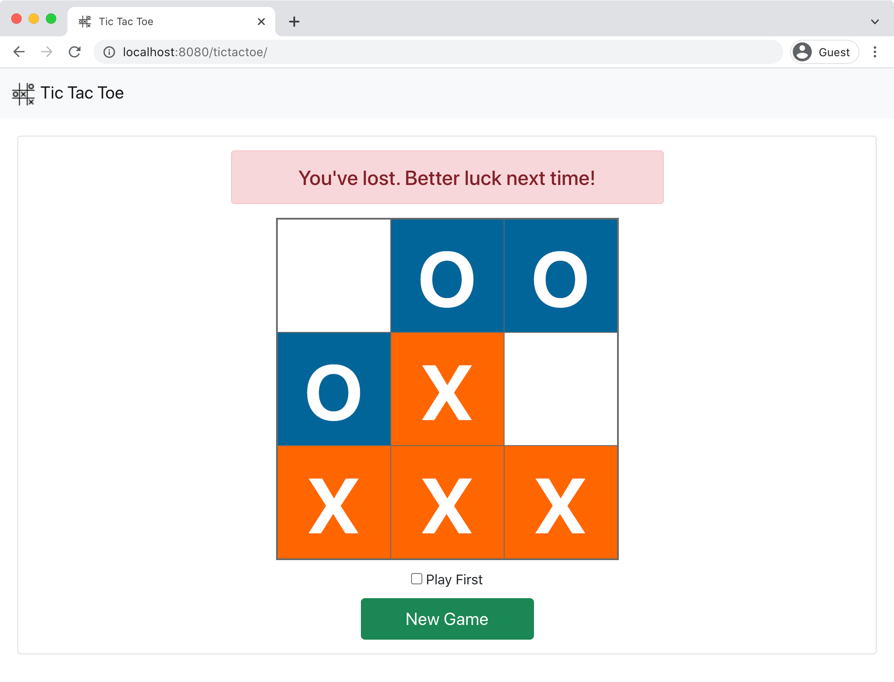

# Tic Tac Toe

A simple web app to play Tic Tac Toe against a dummy computer opponent.
 
## Features & Notes:
* Play a game of Tic Tac Toe on a 3x3 board.
* Start a new game at any time with an option to go first or after the computer opponent.
* Computer opponent's AI is simple and chooses squares at random (except when going first, then center tile is always picked).
* Game data persists to user's http session.
* For sake of simplicity web app does not come with a test suite or ability to persist data to a database.
* App has been designed to render each time through a full page refresh (also in the name of simplicity).
* Player can leave the game and come back later to finish it (as long as his session persists).

## Tech Stack:
* Language: Java 8
* Framework: Spring Boot (v2.5.6)
* UI Layer: HTML, CSS, Javascript, jQuery, [Bootstrap](https://getbootstrap.com/) (v5), [Thymeleaf](http://www.thymeleaf.org/)
* Build Tool: Gradle (v7.2)

## Install & Run:
* Install Java 8.
* Clone repo: `git clone https://github.com/randomvlad/TicTacToe.git`
* Navigate `cd TicTacToe` and run applicable [Gradle Wrapper](https://docs.gradle.org/current/userguide/gradle_wrapper.html#sec:using_wrapper) command:
  * macOS/Unix: `./gradlew bootRun`
  * Windows: `gradlew.bat bootRun`
* Once app is running, go to [http://localhost:8080/tictactoe/](http://localhost:8080/tictactoe/) and play a game.
* To end app, kill process in terminal with `CTRL + C`. 

## Game Screenshots:

 

