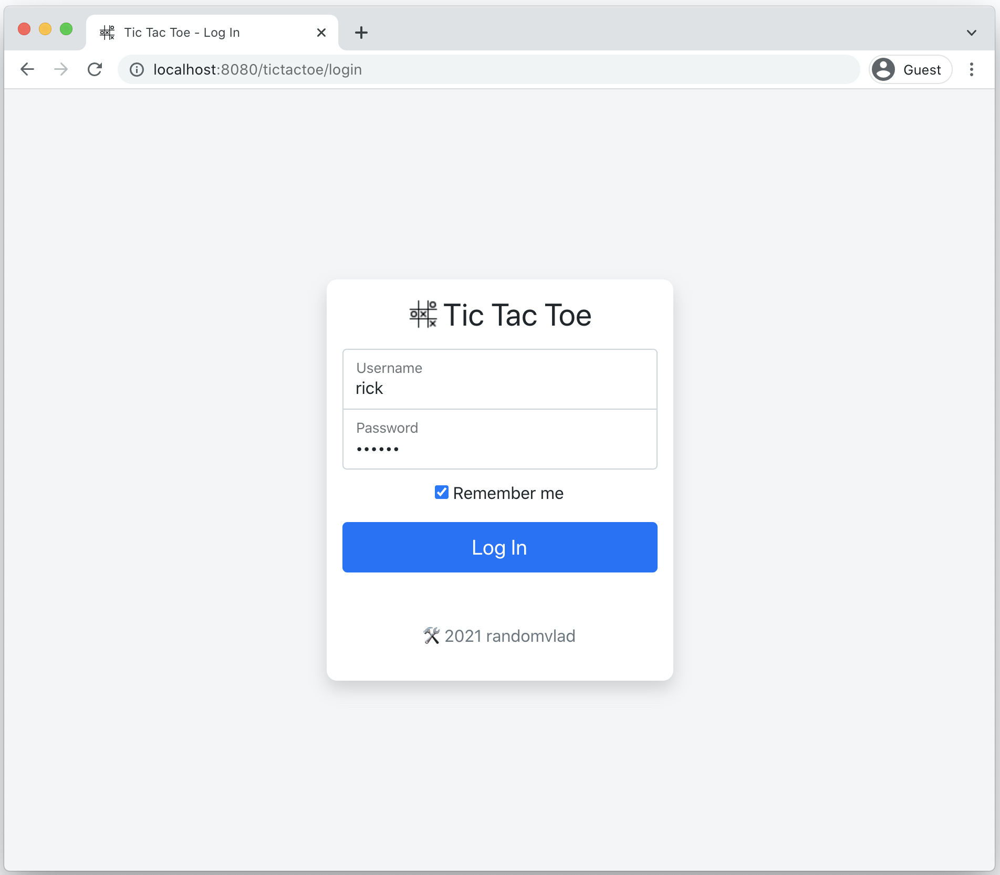
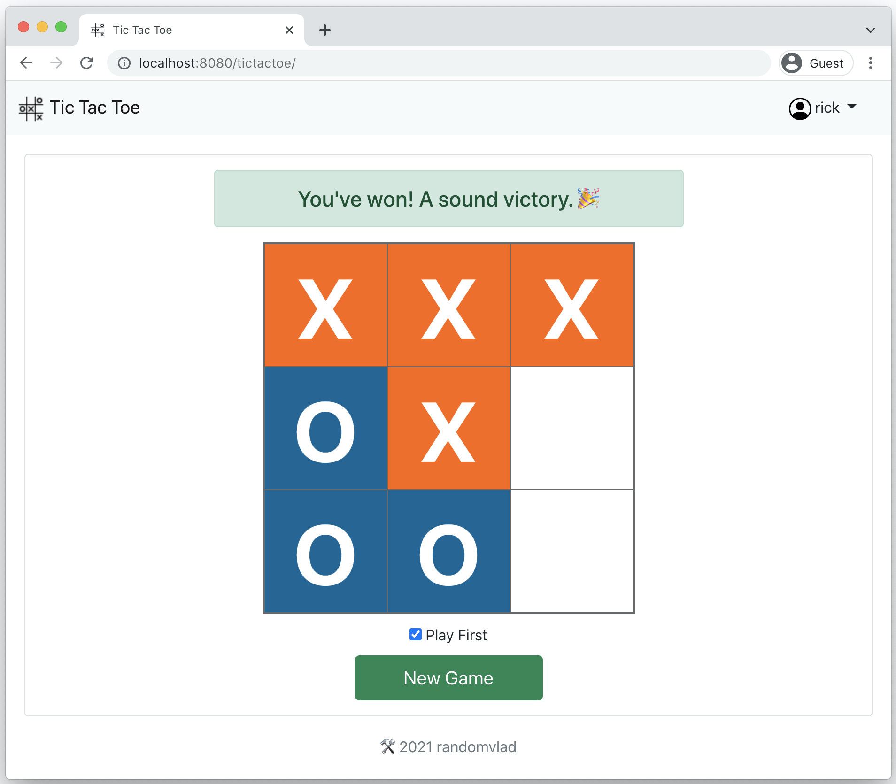
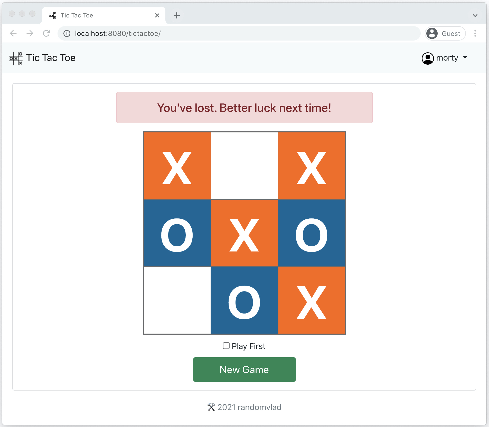

# Tic Tac Toe

A secured web app to play Tic Tac Toe against a dummy computer opponent.

## Features & Notes:
* Play a game on a 3x3 board with an option to go first or after the computer opponent.
* Computer opponent's AI is simple and chooses squares at random (except when going first, then center tile is always picked).
* User game data is persisted to an in-memory database.
* App is secured with a username & password login. Database is seeded with two usernames: `rick` and `morty`. Both have the same password `pickle`.
* UI renders each time through a full page refresh (in the name of simplicity).
* Player can leave/logout and come back later to finish the game (as long as the server hasn't been restarted).
* Unit tests: [src/test/java/tictactoe/*](src/test/java/tictactoe)

> ℹ️ Want to know more about the project and lessons learned along the way? See: [Little Code Gems - Questions & Answers](docs/code-gems.md).

## Tech Stack:
| | Technology |
|---|---|
| __Language__ | Java 11 |
| __Framework__ | Spring Boot (v2.5) |
| __Data Layer__ | H2 Database, JPA & Hibernate | 
| __UI Layer__ | HTML, CSS, Javascript, jQuery, [Bootstrap](https://getbootstrap.com/) (v5), [Thymeleaf](http://www.thymeleaf.org/) |
| __Testing__ | JUnit 5, Mockito, AssertJ |
| __Build Tool__ | Gradle (v7.2) |

## Install & Run:
* Install Java 11.
* Clone repo: `git clone https://github.com/randomvlad/TicTacToe.git`
* Navigate `cd TicTacToe` and run applicable [Gradle Wrapper](https://docs.gradle.org/current/userguide/gradle_wrapper.html#sec:using_wrapper) command:
  * macOS/Unix: `./gradlew bootRun`
  * Windows: `gradlew.bat bootRun`
* Once app is running, go to [http://localhost:8080/tictactoe/](http://localhost:8080/tictactoe/).
* Log in with username `rick` or `morty` and password `pickle` to play a game.
* To end app, kill process in terminal with `CTRL + C`. 

## Game Screenshots:

 

 

