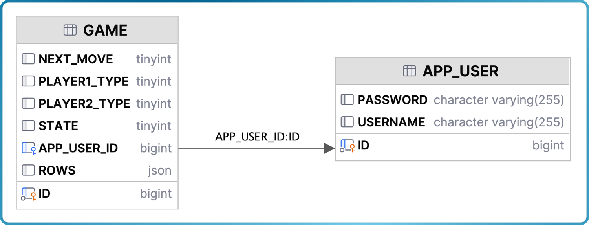
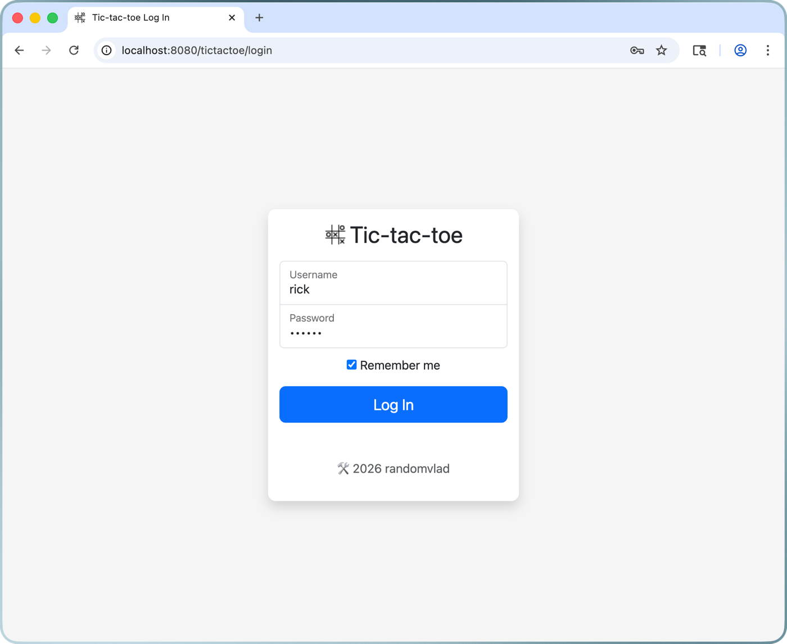
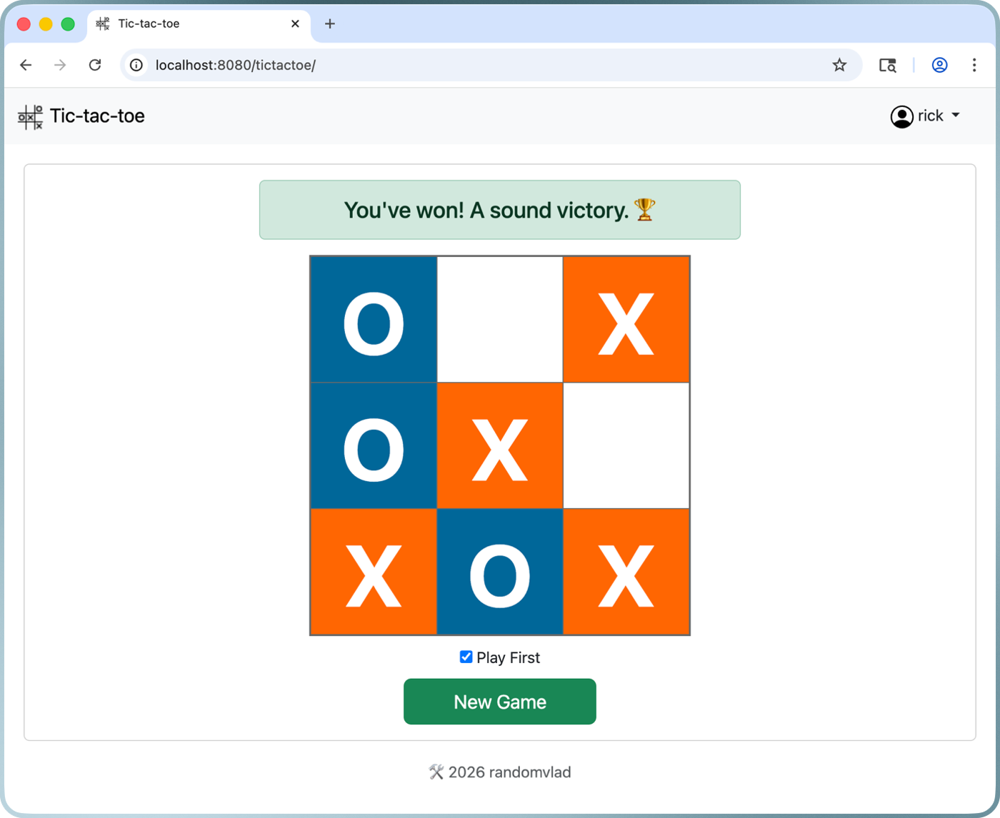
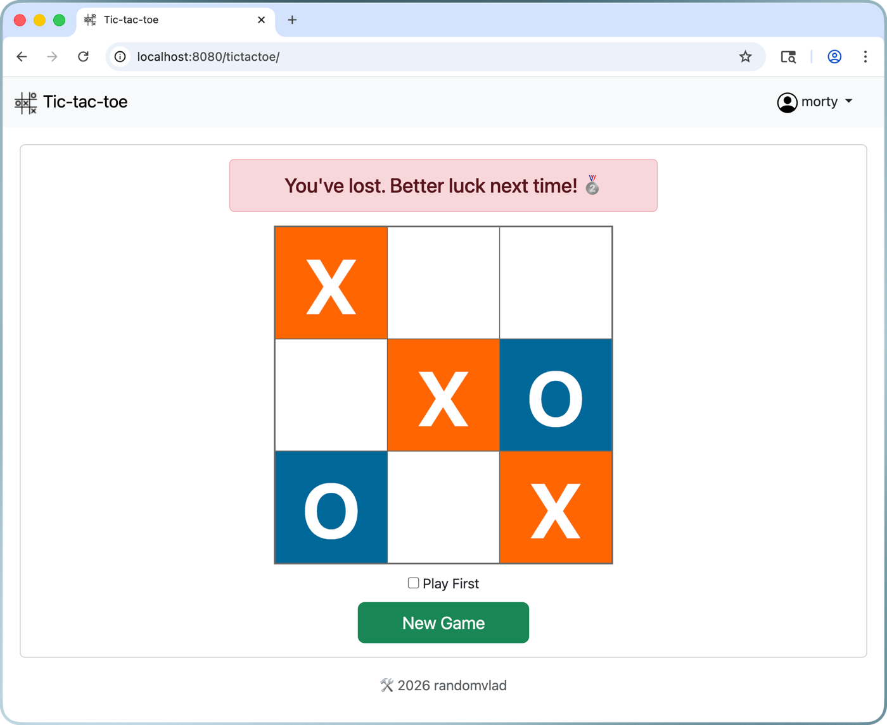
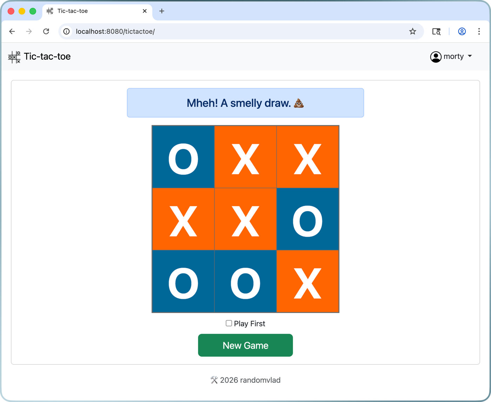
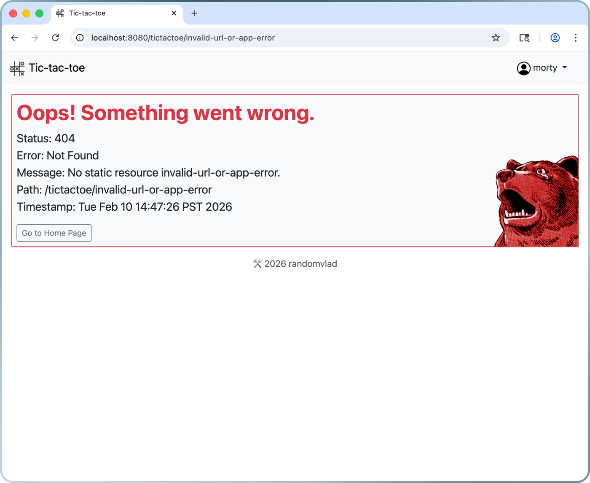

<h1 align="center">
    <br>Tic-tac-toe App
</h1>

[](https://github.com/randomvlad/TicTacToe/actions/workflows/gradle.yml) [](https://github.com/randomvlad/TicTacToe/actions/workflows/codeql.yml) [](https://app.codacy.com/gh/randomvlad/TicTacToe?utm_source=github.com&utm_medium=referral&utm_content=randomvlad/TicTacToe&utm_campaign=Badge_Grade) [](https://codecov.io/github/randomvlad/tictactoe) [](https://snyk.io/test/github/randomvlad/TicTacToe) [](https://scorecard.dev/viewer/?uri=github.com/randomvlad/TicTacToe)
[](https://github.com/randomvlad/TicTacToe/blob/master/LICENSE.txt)

A secured web app to play Tic-tac-toe against a dummy computer opponent.

## Overview
* Play a game on a 3x3 board with an option to go first or after the computer opponent.
* Computer opponent's AI chooses random squares, except when going first in which case the center tile is always picked.
* User game data is persisted to an in-memory database. As long as the server is not restarted, a player can leave and return to finish an in-progress game.  
* App is secured with a username & password login. Database is seeded with two usernames `rick` and `morty`. Both have the same password `pickle`.
* UI renders server-side in the name of simplicity. Each game move results in a full page refresh.
* For more info about the project and lessons learned, see: [Little Code Gems](docs/code-gems.md).
* Unit tests: [src/test/java/tictactoe/*](src/test/java/tictactoe)

## Tech Stack
| | Technology |
|---|---|
| __Language__ | Java 27 |
| __Framework__ | Spring Boot v4.1 |
| __Data Layer__ | H2 Database, JPA & Hibernate v7.4 | 
| __UI Layer__ | HTML, CSS, Javascript, [Bootstrap](https://getbootstrap.com/) v5, [Thymeleaf](http://www.thymeleaf.org/) v3.1 |
| __Testing__ | JUnit 5, Mockito, AssertJ |
| __Build Tool__ | Gradle v9.8 |

## Install & Run
* Install Java 27.
  * Tip: use [SDKMAN!](https://sdkman.io/install/) to effortlessly install and switch between Java versions and distros.
* Clone repo: `git clone https://github.com/randomvlad/TicTacToe.git`
* Navigate `cd TicTacToe` and run applicable [Gradle Wrapper](https://docs.gradle.org/current/userguide/gradle_wrapper.html#sec:using_wrapper) command:
  * macOS/Unix: `./gradlew bootRun`
  * Windows: `gradlew.bat bootRun`
* Once app is running, go to [http://localhost:8080/tictactoe/](http://localhost:8080/tictactoe/).
* Log in with username `rick` or `morty` and password `pickle` to play a game.
* To end app, kill process in terminal with `CTRL + C`. 

## Data Schema

App data is persisted and read from two relational tables `APP_USER` and `GAME`.



Data Definition:
```sql
create table PUBLIC.APP_USER
(
  ID       BIGINT not null primary key,
  PASSWORD CHARACTER VARYING(255),
  USERNAME CHARACTER VARYING(255)
);

create table PUBLIC.GAME
(
  NEXT_MOVE    TINYINT,
  PLAYER1_TYPE TINYINT,
  PLAYER2_TYPE TINYINT,
  STATE        TINYINT,
  APP_USER_ID  BIGINT,
  ID           BIGINT not null primary key,
  ROWS         JSON,
  constraint FKT1UCX1TG677JTR30CQDLR16O5 foreign key (APP_USER_ID) references PUBLIC.APP_USER,
  check ("NEXT_MOVE" BETWEEN 0 AND 1),
  check ("PLAYER1_TYPE" BETWEEN 0 AND 1),
  check ("PLAYER2_TYPE" BETWEEN 0 AND 1),
  check ("STATE" BETWEEN 0 AND 3)
);
```

Tic-tac-toe game state is persisted as JSON (an array of string arrays) to `GAME.ROWS` column. Example:
```json
[
  ["","o","x"],
  ["o","x",""],
  ["x","",""]
]
```

## Screenshots

### Login Page


### Game Won


### Game Lost


### Game Draw


### Custom Error Page 

